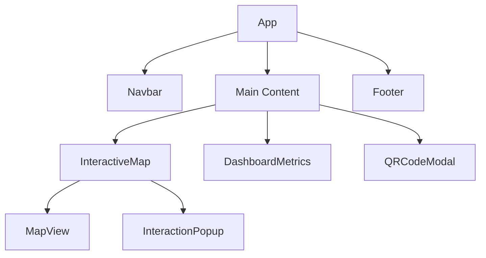

# supmap-webapp

## Vue d'ensemble
Supmap est une application web de cartographie interactive permettant aux utilisateurs de visualiser des incidents, créer des itinéraires et partager des trajets via QR code.

## Architecture des Composants

L'application web est composée d'une seule page. Tous ses éléments sont imbriquées les uns dans les autres selon cette architecture :



## Technologies Utilisées
- **Frontend**: React (v19)
- **Cartographie**: Leaflet avec React-Leaflet
- **Styling**: TailwindCSS
- **État Global**: Zustand
- **Requêtes API**: Axios, TanStack Query
- **Build Tool**: Vite
- **QR Code**: react-qr-code

## Structure du Projet

### Composants Principaux

#### 1. App (`src/App.tsx`)
- Composant racine de l'application
- Gère l'état global des incidents, points utilisateur et formes
- Coordonne les interactions entre les composants

#### 2. InteractiveMap (`src/components/map/InteractiveMap.tsx`)
- Gère la carte interactive
- Fonctionnalités :
    - Affichage des incidents
    - Création d'itinéraires
    - Gestion des points utilisateur
    - Calcul de trajets

#### 3. DashboardMetrics (`src/components/DashboardMetrics.tsx`)
- Affiche les métriques et statistiques
- Fonctionnalités :
    - Nombre d'incidents
    - Détails de l'itinéraire
    - Actions rapides (effacer l'itinéraire, générer QR)

### Composants Auxiliaires

#### 4. MapView (`src/components/map/MapView.tsx`)
- Rendu de la carte Leaflet
- Gestion des événements de carte
- Affichage des marqueurs et polylines

#### 5. QRCodeModal (`src/components/QRCodeModal.tsx`)
- Modal pour générer des QR codes d'itinéraires
- Validation du nom d'itinéraire
- Génération du QR code

## Fonctionnalités Clés

### 1. Gestion des Incidents
- Affichage des incidents sur la carte
- Filtrage par zone géographique
- Popup d'information détaillée
- Mise à jour en temps réel

### 2. Système de Routage
- Création d'itinéraires personnalisés
- Calcul automatique des trajets
- Affichage des distances et temps estimés
- Points de passage multiples

### 3. Partage d'Itinéraires
- Génération de QR codes
- Sauvegarde des informations de route
- Interface modale dédiée

### 4. Interface Utilisateur
- Design responsive
- Navigation intuitive
- Métriques en temps réel
- Thème personnalisé

### 5. Authentification
- Gestion des tokens JWT
- Refresh token automatique
- Interception des requêtes Axios

## Configuration et Environnement

### Variables d'Environnement

Les variables d'environnement pour une application frontend avec Vite sont complexes à gérer. Les variables d'environnement sont injectés dans le code transpilé durant le build.
Dans notre cas, la seule variable d'environnement nécessaire est l'URL vers la gateway qui expose les services.
Nous avons jugé que cette variable n'est en aucun cas critique et avons pris la décision de définir la valeur de cette variable en dur dans le fichier d'environnement Typescript de l'application.

```typescript
// src/config/env.ts
export const env = {
    gatewayHost: "http://localhost:9000",
};
```
